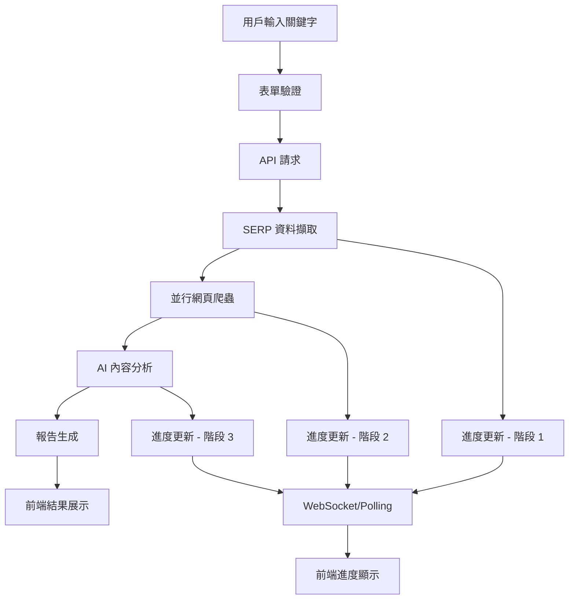

# SEO Analyzer 專案架構指南
*系統架構設計與未來發展藍圖*

## 🏗️ 系統架構概覽

### 當前架構 (MVP 實現)
```
┌─────────────────┐    HTTP/REST   ┌─────────────────┐
│  React Frontend │ ←────────────→ │  FastAPI Backend│
│                 │                │                 │
│ • React 19      │                │ • Python 3.13   │
│ • TypeScript    │                │ • FastAPI       │
│ • Tailwind CSS  │                │ • Pydantic V2   │
│ • Vite 6        │                │ • uv (套件管理)  │
└─────────────────┘                └─────────────────┘
         │                                   │
         │                                   │
         v                                   v
┌─────────────────┐                ┌─────────────────┐
│   Browser       │                │  External APIs  │
│                 │                │                 │
│ • LocalStorage  │                │ • SerpAPI       │
│ • SessionStorage│                │ • Azure OpenAI  │
└─────────────────┘                └─────────────────┘
```

---

## 📁 目錄架構分析

### 當前結構優缺點

#### ✅ **優勢**
1. **清晰的前後端分離**
   - 獨立部署和擴展
   - 技術棧專業化
   - 並行開發可能

2. **完善的文檔系統**
   - 18 個 session 開發記錄
   - API 規格與實現同步
   - 技術決策透明

3. **現代化技術棧**
   - React 19 + TypeScript (前端)
   - FastAPI + Python 3.13 (後端)
   - 符合 2025 最佳實踐

#### ⚠️ **待改善區域**
1. **配置管理分散**
   - 多處配置檔案 (backend/config.ini, frontend/.env)
   - 環境切換複雜

2. **依賴管理複雜**
   - 前端 28 個依賴套件
   - 版本跨度大的相容性問題

3. **缺乏統一監控**
   - 分散的日誌系統
   - 缺乏中央化監控

---

## 🎯 建議的未來架構

### 功能導向重構方案
```
seo-analyzer/
├── 📋 config/                     # 統一配置管理
│   ├── environments/              # 環境特定配置
│   ├── shared/                   # 共享配置
│   └── security/                 # 安全配置
│
├── 🖥️ frontend/                   # 前端應用
│   ├── src/
│   │   ├── features/             # 🆕 功能導向架構
│   │   │   ├── analysis/         # 分析功能模組
│   │   │   ├── progress/         # 進度追蹤功能
│   │   │   └── results/          # 結果展示功能
│   │   │
│   │   └── shared/               # 共享資源
│   │       ├── components/ui/    # 基礎 UI 元件
│   │       ├── hooks/           # 通用 hooks
│   │       └── services/api/     # API 客戶端
│
├── 🔧 backend/                    # 後端應用
│   ├── app/
│   │   ├── features/             # 🆕 領域導向架構
│   │   │   ├── analysis/         # 分析領域
│   │   │   ├── scraping/         # 爬蟲領域
│   │   │   └── ai_processing/    # AI 處理領域
│   │   │
│   │   ├── shared/               # 共享業務邏輯
│   │   ├── infrastructure/       # 基礎設施層
│   │   └── core/                # 核心系統配置
│
├── 📊 monitoring/                 # 🆕 監控與觀測
│   ├── logs/                     # 日誌配置
│   ├── metrics/                  # 指標監控
│   └── alerts/                   # 告警配置
│
└── 🛠️ tools/                      # 🆕 開發工具
    ├── scripts/                  # 自動化腳本
    ├── generators/               # 程式碼生成器
    └── linters/                  # 程式碼檢查
```

---

## 🔄 資料流程架構

### SEO 分析核心流程


### 雙欄位 API 回應架構
```typescript
// 成功回應架構
interface ApiResponse<T> {
  status: "success" | "error";    // API 契約欄位
  success: boolean;               // 業務狀態欄位
  // 成功時的資料 (扁平化結構)
  analysis_report?: string;
  token_usage?: number;
  processing_time?: number;
  // 錯誤時的資料
  error_message?: string;
  error_code?: string;
}
```

---

## 🎨 前端架構設計

### 元件層次結構
```
Components Architecture (功能導向)
├── features/
│   ├── analysis/
│   │   ├── components/
│   │   │   ├── InputForm/          # 分析表單
│   │   │   ├── OptionsPanel/       # 選項設定
│   │   │   └── ValidationDisplay/  # 驗證回饋
│   │   ├── hooks/
│   │   │   ├── useAnalysisForm/    # 表單邏輯
│   │   │   └── useFormValidation/  # 驗證邏輯
│   │   └── services/
│   │       └── analysisApi.ts      # API 整合
│   │
│   ├── progress/
│   │   ├── components/
│   │   │   ├── ProgressIndicator/  # 主要進度元件
│   │   │   ├── StageDisplay/       # 階段顯示
│   │   │   └── TimeEstimator/      # 時間估算
│   │   └── hooks/
│   │       ├── useProgress/        # 進度管理
│   │       └── useWebSocket/       # 即時通訊
│   │
│   └── results/
│       ├── components/
│       │   ├── MarkdownViewer/     # Markdown 渲染
│       │   ├── ExportButtons/      # 匯出功能
│       │   └── SearchHighlight/    # 搜尋高亮
│       └── hooks/
│           └── useMarkdownParser/  # Markdown 解析
│
└── shared/
    ├── components/ui/              # 基礎 UI 元件
    │   ├── Button/
    │   ├── Input/
    │   ├── Modal/
    │   └── Toast/
    ├── hooks/                      # 通用 Hooks
    │   ├── useDebounce/
    │   ├── useLocalStorage/
    │   └── useApiClient/
    └── services/                   # 共享服務
        ├── api/                    # API 客戶端
        ├── cache/                  # 前端快取
        └── websocket/              # WebSocket 服務
```

### 狀態管理策略
```typescript
// Context + Reducer 模式 (專案採用)
interface AppState {
  analysis: AnalysisState;
  progress: ProgressState;
  ui: UIState;
}

// Hook-based 狀態管理 (當前實現)
const useAnalysis = (): [AnalysisState, AnalysisActions] => {
  // 本地狀態 + API 整合
  // 支援 optimistic updates
  // 錯誤處理和重試邏輯
};
```

---

## ⚙️ 後端架構設計

### DDD 分層架構
```
Domain-Driven Design Structure
├── features/ (Domain Layer)
│   ├── analysis/
│   │   ├── api/                    # API 路由層
│   │   │   └── analysis_router.py
│   │   ├── services/               # 業務邏輯層
│   │   │   ├── analysis_service.py
│   │   │   └── report_generator.py
│   │   ├── models/                 # 領域模型
│   │   │   └── analysis_models.py
│   │   └── schemas/                # 資料驗證
│   │       └── analysis_schemas.py
│   │
│   ├── scraping/
│   │   ├── services/
│   │   │   ├── serp_service.py     # SerpAPI 整合
│   │   │   └── crawler_service.py  # 網頁爬蟲
│   │   └── models/
│   │       └── scraping_models.py
│   │
│   └── ai_processing/
│       ├── services/
│       │   ├── ai_service.py       # Azure OpenAI 整合
│       │   └── prompt_manager.py   # Prompt 管理
│       └── models/
│           └── ai_models.py
│
├── shared/ (Application Layer)
│   ├── services/                   # 共享業務服務
│   ├── utils/                      # 工具函式
│   ├── exceptions/                 # 自訂例外
│   └── types/                      # 型別定義
│
├── infrastructure/ (Infrastructure Layer)
│   ├── database/                   # 資料庫實作
│   ├── cache/                      # 快取實作 (Redis)
│   ├── message_queue/              # 任務佇列
│   └── external_apis/              # 外部 API 整合
│
└── core/ (Core Layer)
    ├── config/                     # 配置管理
    ├── security/                   # 安全機制
    ├── middleware/                 # 中介軟體
    └── database/                   # 資料庫核心
```

### API 路由架構
```python
# 主要路由結構
from fastapi import APIRouter

# 功能導向路由
analysis_router = APIRouter(prefix="/api/analysis", tags=["analysis"])
progress_router = APIRouter(prefix="/api/progress", tags=["progress"])
health_router = APIRouter(prefix="/api/health", tags=["health"])

# 路由組織
@analysis_router.post("/")
async def analyze_keyword(request: AnalysisRequest) -> AnalysisResponse:
    """執行 SEO 關鍵字分析"""

@progress_router.get("/{job_id}")
async def get_progress(job_id: str) -> ProgressResponse:
    """取得分析進度"""
```

---

## 🔌 整合架構設計

### WebSocket 即時通訊架構 (規劃中)
```
WebSocket Communication Flow
┌─────────────────┐    WebSocket    ┌─────────────────┐
│   Frontend      │ ←──────────────→│   Backend       │
│                 │                 │                 │
│ • useWebSocket  │   Job Progress  │ • SocketManager │
│ • Fallback Poll │   Updates       │ • Room Manager  │
│ • Auto Reconnect│                 │ • Event Handler │
└─────────────────┘                 └─────────────────┘
         │                                   │
         │ Fallback (網路問題時)              │
         v                                   v
┌─────────────────┐    HTTP Poll    ┌─────────────────┐
│  Polling Client │ ←──────────────→│  Progress API   │
└─────────────────┘                 └─────────────────┘
```

### 外部服務整合
```python
# 外部 API 整合架構
class ExternalServiceManager:
    def __init__(self):
        self.serp_client = SerpAPIClient()
        self.openai_client = AzureOpenAIClient()
        self.cache_client = RedisClient()

    async def get_serp_data(self, keyword: str) -> dict:
        # 實作快取策略
        cached = await self.cache_client.get(f"serp:{keyword}")
        if cached:
            return cached

        # 呼叫 SerpAPI
        data = await self.serp_client.search(keyword)
        await self.cache_client.set(f"serp:{keyword}", data, ttl=3600)
        return data
```

---

## 📊 資料庫架構設計 (未來擴展)

### 資料模型設計
```sql
-- 未來資料庫架構 (目前為無狀態設計)

-- 分析任務表
CREATE TABLE analysis_jobs (
    id UUID PRIMARY KEY,
    keyword VARCHAR(50) NOT NULL,
    audience VARCHAR(200) NOT NULL,
    options JSONB NOT NULL,
    status VARCHAR(20) NOT NULL,
    created_at TIMESTAMP DEFAULT NOW(),
    completed_at TIMESTAMP,
    result JSONB
);

-- 進度追蹤表
CREATE TABLE job_progress (
    job_id UUID REFERENCES analysis_jobs(id),
    stage INTEGER NOT NULL, -- 1=SERP, 2=Crawler, 3=AI
    progress INTEGER NOT NULL, -- 0-100
    message TEXT,
    updated_at TIMESTAMP DEFAULT NOW()
);

-- SERP 快取表
CREATE TABLE serp_cache (
    keyword_hash VARCHAR(64) PRIMARY KEY,
    keyword VARCHAR(50) NOT NULL,
    data JSONB NOT NULL,
    expires_at TIMESTAMP NOT NULL,
    created_at TIMESTAMP DEFAULT NOW()
);
```

---

## 🚀 部署架構設計

### 容器化部署
```yaml
# docker-compose.yml (未來生產環境)
version: '3.8'
services:
  frontend:
    build: ./frontend
    ports:
      - "3000:3000"
    environment:
      - VITE_API_BASE_URL=http://backend:8000

  backend:
    build: ./backend
    ports:
      - "8000:8000"
    environment:
      - DATABASE_URL=postgresql://user:pass@db:5432/seo_analyzer
      - REDIS_URL=redis://redis:6379
    depends_on:
      - db
      - redis

  db:
    image: postgres:15
    environment:
      - POSTGRES_DB=seo_analyzer
      - POSTGRES_USER=user
      - POSTGRES_PASSWORD=pass
    volumes:
      - postgres_data:/var/lib/postgresql/data

  redis:
    image: redis:7
    volumes:
      - redis_data:/data

volumes:
  postgres_data:
  redis_data:
```

### Kubernetes 部署 (未來擴展)
```yaml
# k8s-deployment.yml
apiVersion: apps/v1
kind: Deployment
metadata:
  name: seo-analyzer-backend
spec:
  replicas: 3
  selector:
    matchLabels:
      app: seo-analyzer-backend
  template:
    metadata:
      labels:
        app: seo-analyzer-backend
    spec:
      containers:
      - name: backend
        image: seo-analyzer/backend:latest
        ports:
        - containerPort: 8000
        env:
        - name: DATABASE_URL
          valueFrom:
            secretKeyRef:
              name: db-secret
              key: url
```

---

## 📈 擴展性架構考量

### 微服務拆分建議 (未來)
```
服務拆分策略 (當規模擴大時)
├── API Gateway                    # 統一入口
├── Analysis Service              # 核心分析服務
├── Scraping Service             # 爬蟲服務
├── AI Processing Service        # AI 處理服務
├── Progress Tracking Service    # 進度追蹤服務
├── Cache Service               # 快取服務
├── Notification Service        # 通知服務
└── User Management Service     # 用戶管理 (未來)
```

### 效能最佳化策略
```python
# 快取層次架構
L1: Browser Cache (前端)
L2: CDN Cache (靜態資源)
L3: Redis Cache (API 回應)
L4: Application Cache (記憶體快取)
L5: Database Cache (查詢快取)

# 異步處理架構
class AsyncJobProcessor:
    def __init__(self):
        self.task_queue = CeleryQueue()  # 任務佇列
        self.result_backend = RedisBackend()  # 結果儲存

    async def submit_analysis(self, request: AnalysisRequest) -> str:
        job_id = uuid4().hex
        task = self.task_queue.delay('process_analysis', job_id, request)
        return job_id
```

---

## 🔒 安全架構設計

### 安全層次
```
Security Layers
├── Network Security (Firewall, VPN)
├── Application Security (Authentication, Authorization)
├── Data Security (Encryption, Validation)
└── Infrastructure Security (Container, K8s)
```

### API 安全實現
```python
# JWT Token 驗證 (未來實現)
@app.middleware("http")
async def authentication_middleware(request: Request, call_next):
    if request.url.path.startswith("/api/protected"):
        token = request.headers.get("Authorization")
        if not token or not verify_jwt_token(token):
            return JSONResponse(
                status_code=401,
                content={"error": "Unauthorized"}
            )
    response = await call_next(request)
    return response

# 輸入驗證和消毒
class SecureAnalysisRequest(BaseModel):
    keyword: str = Field(..., min_length=1, max_length=50)
    audience: str = Field(..., min_length=1, max_length=200)

    @validator('keyword', 'audience')
    def sanitize_input(cls, v):
        # HTML 標籤移除, SQL 注入防護
        return sanitize_string(v)
```

---

## 📊 監控與觀測架構

### 可觀測性三支柱
```
Observability Stack
├── Metrics (Prometheus + Grafana)
│   ├── API 回應時間
│   ├── 錯誤率統計
│   └── 系統資源使用
│
├── Logging (ELK Stack)
│   ├── 應用程式日誌
│   ├── 存取日誌
│   └── 錯誤日誌
│
└── Tracing (Jaeger)
    ├── 分散式追蹤
    ├── 效能瓶頸識別
    └── 依賴關係映射
```

### 告警配置
```yaml
# Prometheus 告警規則
groups:
- name: seo-analyzer
  rules:
  - alert: HighErrorRate
    expr: rate(http_requests_total{status=~"5.."}[5m]) > 0.1
    for: 2m
    labels:
      severity: critical
    annotations:
      summary: "High error rate detected"

  - alert: SlowResponseTime
    expr: histogram_quantile(0.95, rate(http_request_duration_seconds_bucket[5m])) > 2
    for: 5m
    labels:
      severity: warning
    annotations:
      summary: "Slow response time detected"
```

---

## 🔄 遷移策略

### 階段性改造計劃

#### **階段 1: 配置統一 (1-2 週)**
```bash
目標: 建立統一配置管理
- 建立 config/ 目錄結構
- 遷移現有配置檔案
- 更新應用程式配置讀取邏輯
- 測試多環境部署
```

#### **階段 2: 前端重構 (2-3 週)**
```bash
目標: 功能導向架構重構
- 建立 features/ 目錄架構
- 遷移現有元件到功能模組
- 重新組織共享資源 (shared/)
- 更新測試架構配套
```

#### **階段 3: 後端重構 (2-3 週)**
```bash
目標: DDD 分層架構實施
- 實作領域導向分層架構
- 建立基礎設施層抽象
- 遷移業務邏輯到功能模組
- 完善測試覆蓋和文檔
```

#### **階段 4: 監控與工具 (1-2 週)**
```bash
目標: 完整開發體驗
- 建立監控和日誌系統
- 設置開發工具鏈
- 完善 CI/CD 管道
- 建立性能基線和告警
```

---

## 📊 架構演進規劃

### 短期目標 (3-6 個月)
- ✅ 完善 WebSocket 即時通訊
- ✅ 建立完整的測試覆蓋
- ✅ 實施功能導向重構
- ✅ 完善監控和日誌系統

### 中期目標 (6-12 個月)
- 🔄 引入資料庫持久化
- 🔄 實作用戶系統和認證
- 🔄 建立多租戶架構
- 🔄 容器化和 K8s 部署

### 長期目標 (1-2 年)
- 🚀 微服務架構拆分
- 🚀 多區域部署和 CDN
- 🚀 機器學習模型整合
- 🚀 企業級安全認證

---

## 📚 架構決策紀錄 (ADR)

### ADR-001: 雙欄位 API 回應格式
**決策**: 採用 `status` + `success` 雙欄位設計
**理由**: 支援 API 成功但業務部分失敗的細粒度場景
**影響**: 前端需要同時檢查兩個欄位，但提供更精確的狀態管理

### ADR-002: 功能導向目錄架構
**決策**: 採用 features/ 而非 components/ 架構
**理由**: 提高內聚性，降低耦合度，便於團隊並行開發
**影響**: 需要重構現有代碼，但長期維護性大幅提升

### ADR-003: FastAPI + React 技術選型
**決策**: 後端 FastAPI，前端 React 19 + TypeScript
**理由**: 現代化、高效能、型別安全的全端解決方案
**影響**: 學習曲線適中，社群支援完善，未來擴展性佳

---

**此架構指南將隨著專案發展持續更新，確保技術決策的透明度和一致性。所有重大架構變更都應更新此文檔並記錄決策理由。**

---
*最後更新: 2025-09-05*
*版本: v1.0*
*配合 development-rules.md 和 development-checklist.md 使用*
