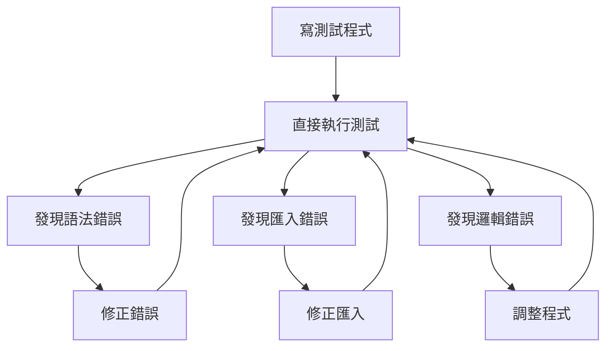
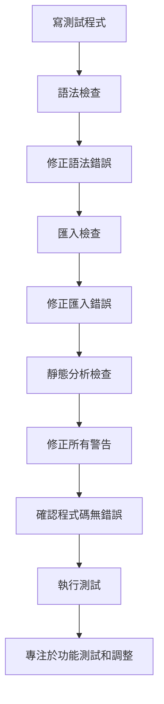

# QA 測試上下文

## 最後更新：2025-08-27 14:00
## 負責人：QA Engineer  
## 當前 Session：#4
## 重要更新：新增正確的測試開發流程

## 🎯 測試目標與策略
- **總體目標**: 確保 SEO Analyzer 在 60 秒內穩定產出高質量報告
- **品質標準**: 爬蟲成功率 ≥ 80%，API 回應時間 < 60 秒
- **技術棧**: Python 3.13.5 + React 18.3 + TypeScript 5.9 + Vite 6

## 📋 正確的測試開發流程 (2025年最佳實務)

### 🚨 **重要原則：先檢查，後測試** 

#### ⚠️ **流程違反的嚴重後果**:
- **浪費開發時間**: 在測試中發現本應該靜態檢查發現的錯誤
- **降低程式品質**: 跳過檢查導致低品質程式碼進入版本控制
- **破壞專業形象**: 提交包含基本錯誤的代碼給人不專業印象
- **增加維護成本**: 後續修正錯誤需要額外的 commit 和 push
- **影響團隊效率**: 其他開發者需要處理你的錯誤代碼

#### 🔒 **絕對禁止的行為**:
```bash
# ❌ 絕對不允許：直接跳到測試
python -m pytest tests/unit/test_something.py  # 沒有先檢查

# ❌ 絕對不允許：有錯誤就直接提交
git add . && git commit -m "fix"  # 沒有驗證代碼品質

# ❌ 絕對不允許：執行失敗就修改再測試
pytest -> 失敗 -> 修改 -> pytest  # 沒有靜態檢查
```

#### ❌ **錯誤流程** (嚴格避免使用)

**問題：浪費大量時間在反覆修正明顯錯誤**

#### ✅ **正確流程** (必須遵守)

**優勢：一次性解決靜態問題，專注於邏輯測試**

### 🛠️ **詳細執行步驟**

#### **第1步：寫測試程式時的思考方法**
```python
# 🧠 寫程式前先 THINK HARD:
"""
1. 我要匯入哪些模組？這些模組存在嗎？
2. 路徑設定正確嗎？
3. 變數名稱拼寫正確嗎？
4. 函數參數對應正確嗎？
5. 回傳值格式符合預期嗎？
"""

# ✅ 先確認模組存在再匯入
try:
    from app.services.ai_service import AIService
except ImportError:
    # 設定路徑再重試
    import sys
    from pathlib import Path
    sys.path.insert(0, str(Path(__file__).parent.parent.parent))
    from app.services.ai_service import AIService
```

#### **第2步：語法和匯入檢查**
```bash
# 🔍 語法檢查 (必須通過)
cd backend
python -m py_compile tests/integration/test_api_endpoints.py

# 🔍 匯入檢查 (必須通過)
python -c "import tests.integration.test_api_endpoints"

# 🔍 收集測試檢查 (必須通過)
python -m pytest tests/integration/test_api_endpoints.py --collect-only
```

#### **第3步：靜態分析檢查**
```bash
# 🔍 Pylint 檢查 (修正所有錯誤和警告)
pylint tests/integration/test_api_endpoints.py

# 🔍 類型檢查 (如果使用 mypy)
mypy tests/integration/test_api_endpoints.py

# 🔍 IDE 診斷檢查
# 在 VS Code 中檢查 Problems 面板，確保無紅色錯誤
```

#### **第4步：修正所有靜態問題**
```python
# ❌ 常見問題和修正
# 1. 尾隨空格 - 使用編輯器自動清除
# 2. 匯入順序 - 標準庫 → 第三方 → 本地模組
# 3. 未使用變數 - 使用 _ 前綴或移除
# 4. 行長度 - 拆分為多行
# 5. Missing docstring - 添加說明文字
```

#### **第5步：強制檢查清單** ⚠️ **必須 100% 完成才能繼續**
```bash
# 🔍 第5.1步：語法檢查 (強制必須通過)
python -m py_compile tests/integration/test_api_endpoints.py
echo "✅ 語法檢查通過" || exit 1

# 🔍 第5.2步：匯入檢查 (強制必須通過)  
PYTHONPATH=. python -c "import tests.integration.test_api_endpoints"
echo "✅ 匯入檢查通過" || exit 1

# 🔍 第5.3步：測試收集檢查 (強制必須通過)
PYTHONPATH=. python -m pytest tests/integration/test_api_endpoints.py --collect-only
echo "✅ 測試收集檢查通過" || exit 1

# 🔍 第5.4步：靜態分析檢查 (強制必須通過或標註忽略原因)
pylint tests/integration/test_api_endpoints.py
echo "✅ Pylint 檢查完成" || echo "⚠️ 有 Pylint 警告，必須處理"
```

#### **🚨 檢查清單確認** (全部打勾才能執行測試):
- [ ] **語法檢查**: `python -m py_compile` 通過 ✅
- [ ] **匯入檢查**: `python -c "import module_name"` 通過 ✅  
- [ ] **收集檢查**: `pytest --collect-only` 通過 ✅
- [ ] **靜態分析**: Pylint 分數 > 8.0 (或無錯誤) ✅
- [ ] **IDE 診斷**: VS Code Problems 面板無紅色錯誤 ✅
- [ ] **警告處理**: 所有警告已處理或標註忽略原因 ✅

#### ⛔ **檢查清單未完成禁止事項**:
- **禁止執行測試**: 任一項檢查未通過就禁止 `pytest` 
- **禁止提交代碼**: 靜態檢查未通過就禁止 `git commit`
- **禁止推送更改**: 所有問題未解決就禁止 `git push`

#### **第6步：執行測試** (僅在檢查清單 100% 完成後)
```bash
# 🚀 現在才執行測試
python -m pytest tests/integration/test_api_endpoints.py -v

# 🎯 專注於功能邏輯問題
# - 測試邏輯是否正確
# - Mock 設定是否適當
# - 斷言條件是否準確
# - 效能要求是否滿足
```

### 🧠 **Think Hard 原則**

#### **寫程式前思考 (Pre-Code Thinking)**
```python
"""
🧠 THINK HARD:
1. 這個測試要驗證什麼？
2. 需要 Mock 哪些外部依賴？
3. 輸入資料格式是什麼？
4. 預期輸出格式是什麼？
5. 可能的邊界情況有哪些？
6. 效能要求是什麼？
"""

class TestAPIEndpoints:
    """API 端點測試 - 經過深思熟慮的設計。"""
    
    def test_analyze_success(self):
        # 🧠 思考：要測試成功案例
        # 🧠 需要：mock integration service
        # 🧠 輸入：AnalyzeRequest 物件
        # 🧠 輸出：AnalyzeResponse 物件
        # 🧠 驗證：狀態碼、回應格式、處理時間
        pass
```

#### **寫每行程式碼時思考 (Line-by-Line Thinking)**
```python
# 🧠 THINK: 需要匯入什麼？檢查模組是否存在
from backend.app.models.request import AnalyzeRequest

# 🧠 THINK: 變數名稱拼寫正確嗎？
response = await async_client.post(  # ✅ client, post 都對
    "/api/analyze",                  # ✅ endpoint 正確
    json=request.model_dump()        # ✅ Pydantic 方法正確
)

# 🧠 THINK: 回應結構是什麼？
assert response.status_code == 200   # ✅ HTTP 狀態碼
assert response_data["status"] == "success"  # ✅ API 回應格式
```

### 🚫 **嚴禁的反面模式**

#### **反面模式 1：寫完就跑**
```python
# ❌ 不思考就寫，立即執行
def test_something():
    result = some_function()  # 拼寫錯誤
    assert result == expected  # 變數未定義
# 直接執行 pytest，浪費時間修正明顯錯誤
```

#### **反面模式 2：邊寫邊跑**
```python
# ❌ 每寫幾行就執行測試
def test_api():
    response = client.post("/api")  # 測試一下
    # 發現錯誤，修正...
    assert response.status == 200   # 再測試一下
    # 又發現錯誤，再修正...
```

#### **反面模式 3：忽視警告**
```python
# ❌ 有警告但直接執行測試
import unused_module  # Pylint警告但不管
def test_func(arg1):  # 參數未使用但不管
    pass
# 直接執行，增加後續維護成本
```

### 🎯 **效益分析**

#### **時間效益**
- **錯誤流程**：平均每個測試檔案需要 5-8 輪修正
- **正確流程**：平均每個測試檔案需要 1-2 輪修正
- **時間節省**：60-75% 的調試時間

#### **品質效益**
- **程式碼品質**：Pylint 分數 > 8.0
- **維護性**：清晰的程式碼結構和文檔
- **穩定性**：減少因粗心錯誤導致的問題

#### **心理效益**
- **專注力**：專注於邏輯而非語法錯誤
- **成就感**：一次通過帶來的滿足感
- **信心**：對程式碼品質的信心

### 📋 **檢查清單模板**

```markdown
## 測試檔案開發檢查清單

### Phase 1: 設計和規劃
- [ ] 明確測試目標和範圍
- [ ] 確認被測試的 API 存在且了解其介面
- [ ] 設計測試資料和 Mock 策略
- [ ] 規劃測試案例和邊界條件

### Phase 2: 程式碼撰寫
- [ ] 使用正確的匯入順序 (標準庫 → 第三方 → 本地)
- [ ] 添加適當的 docstring 和註釋
- [ ] 使用描述性的變數和函數名稱
- [ ] 遵循一致的程式碼風格

### Phase 3: 靜態檢查
- [ ] `python -m py_compile <test_file>` 通過
- [ ] `python -c "import <test_module>"` 通過
- [ ] `pytest --collect-only <test_file>` 通過
- [ ] Pylint 檢查無錯誤或已標註忽略原因
- [ ] IDE 診斷無紅色錯誤

### Phase 4: 測試執行
- [ ] 執行測試並驗證功能邏輯
- [ ] 檢查測試覆蓋率和邊界情況
- [ ] 驗證效能要求
- [ ] 確認錯誤處理和異常情況

### Phase 5: 程式碼審查
- [ ] 移除未使用的匯入和變數
- [ ] 確認測試案例的完整性
- [ ] 驗證 Mock 設定的正確性
- [ ] 檢查文檔和註釋的準確性
```

### 🎓 **培養習慣**

#### **日常實踐**
1. **每次寫程式前**：花 30 秒思考要做什麼
2. **每寫 10 行程式碼**：停下來檢查語法和邏輯
3. **每完成一個函數**：執行靜態檢查
4. **每完成一個檔案**：執行完整檢查清單

#### **長期改進**
1. **記錄常犯錯誤**：建立個人錯誤清單
2. **建立程式碼模板**：標準化常用結構
3. **使用自動化工具**：pre-commit hooks, IDE 擴展
4. **定期檢討**：分析哪些錯誤可以提前避免

這個流程將大幅提高開發效率和程式碼品質，並且養成良好的程式設計習慣。

## 🛡️ 代碼品質常見問題

### 問題類型 4: 代碼品質與格式問題

#### 4.1 尾隨空白 (Trailing Whitespace)
**錯誤表現**: IDE 偵測到行尾有多餘空格
```
Line 378 has trailing whitespace
```

**錯誤原因**:
- 編輯器自動格式化時產生多餘空白
- 複製貼上時帶入隱藏空格
- 多人協作時格式化設定不一致

**修復方式**:
```python
# 使用編輯器功能移除尾隨空白
# VS Code: Ctrl+Shift+P -> "Trim Trailing Whitespace"
# 或在 settings.json 中設定自動移除：
"files.trimTrailingWhitespace": true
```

#### 4.2 匯入順序問題 (Import Order)
**錯誤表現**: 標準庫匯入應在第三方庫之前
```python
import pytest  # 第三方庫
import sys     # 標準庫 - 錯誤順序
```

**錯誤原因**:
- 未遵循 PEP 8 匯入順序規範
- IDE 自動匯入時順序不正確
- 手動添加匯入時插入位置錯誤

**修復方式**:
```python
# 正確的匯入順序
import sys              # 1. 標準庫
from pathlib import Path

import pytest           # 2. 第三方庫
from unittest.mock import Mock

from app.config import get_config  # 3. 本地模組
```

#### 4.3 未使用的匯入 (Unused Imports)
**錯誤表現**: 引入但未使用的模組
```python
from app.services.serp_service import SerpAPIException  # 未使用
```

**錯誤原因**:
- 重構代碼時遺留的舊匯入
- 複製範例代碼時帶入多餘匯入
- IDE 自動匯入但實際未使用

**修復方式**:
```python
# 選項1: 移除未使用的匯入
# 選項2: 添加 pylint 忽略註釋
# pylint: disable=unused-import
from app.services.serp_service import SerpAPIException
```

#### 4.4 例外處理最佳實務
**錯誤表現**: 拋出過於通用的例外
```python
raise Exception("Connection timeout")  # 過於通用
```

**錯誤原因**:
- 使用通用 Exception 而非具體例外類型
- 缺乏適當的例外層次結構
- 測試代碼中模擬例外時使用通用類型

**修復方式**:
```python
# 使用具體的例外類型
raise ConnectionError("Connection timeout")
# 或建立自定義例外
class APITimeoutError(Exception):
    pass
raise APITimeoutError("API request timeout")
```

#### 4.5 代碼風格一致性
**預防措施**:
1. **使用自動格式化工具**:
   ```bash
   pip install black isort
   black tests/unit/
   isort tests/unit/
   ```

2. **配置 pylint 規則**:
   ```ini
   # .pylintrc
   [MESSAGES CONTROL]
   disable=trailing-whitespace,unused-import
   ```

3. **Git pre-commit hooks**:
   ```yaml
   # .pre-commit-config.yaml
   repos:
   - repo: https://github.com/psf/black
     hooks:
     - id: black
   - repo: https://github.com/pycqa/isort
     hooks:
     - id: isort
   ```

## 📂 測試架構
```
# 後端測試
backend/tests/                     # Python 3.13.5 + pytest
├── conftest.py                    # pytest 配置 ⏳
├── unit/
│   ├── test_serp_service.py      # SerpAPI 服務測試 ⏳
│   ├── test_scraper.py           # 網頁爬蟲測試 ⏳
│   ├── test_ai_service.py        # GPT-4o 分析測試 ⏳
│   └── test_config.py            # config.ini 讀取測試 ⏳
└── integration/
    ├── test_api_endpoints.py     # API 端點整合測試 ⏳
    └── test_service_integration.py # 服務間整合測試 ⏳

# 前端測試  
frontend/tests/                    # Vitest + React Testing Library
├── setup.ts                      # 測試配置 ⏳
├── components/
│   ├── form/
│   │   └── InputForm.test.tsx    # 表單驗證測試 ⏳
│   ├── progress/
│   │   └── ProgressIndicator.test.tsx # 進度顯示測試 ⏳
│   └── ui/
│       └── MarkdownViewer.test.tsx # 結果渲染測試 ⏳
├── hooks/
│   ├── api/
│   │   └── useAnalysis.test.ts   # API 呼叫 Hook 測試 (✅ 已存在)
│   └── progress/
│       └── useProgress.test.ts   # 進度管理 Hook 測試 ⏳
└── utils/
    ├── api.test.ts               # API 工具測試 ⏳
    └── validation.test.ts        # 驗證邏輯測試 ⏳

# QA 測試套件
qa/
├── conftest.py                   # 全域 pytest 配置 ⏳
├── utils/                        # 測試工具 ⏳
│   ├── __init__.py
│   ├── fixtures.py              # 共用 fixtures
│   ├── helpers.py               # 測試輔助函數
│   └── mock_data.py             # Mock 資料生成器
├── e2e_tests/                    # Playwright
│   ├── conftest.py              # E2E 測試配置 ⏳
│   ├── test_happy_path.py       # 完整成功流程 ⏳
│   ├── test_error_scenarios.py  # 錯誤處理流程 ⏳
│   └── test_performance_limits.py # 60秒限制測試 ⏳
├── performance/                  # 效能測試
│   ├── conftest.py              # 效能測試配置 ⏳
│   ├── test_performance.py      # 效能基準測試 ⏳
│   ├── load_testing.py          # 負載測試 ⏳
│   └── stress_testing.py        # 壓力測試 ⏳
├── test_data/                    # 測試資料
│   ├── mock_serp_responses.json # SERP API 模擬回應 ✅
│   ├── mock_scrape_data.json    # 爬蟲模擬數據 ✅
│   ├── mock_ai_responses.json   # GPT-4o 模擬回應 ✅
│   ├── test_keywords.json       # 測試關鍵字集合 ✅
│   └── fixtures/                # 測試 fixtures ⏳
│       ├── api_responses/       # API 回應範例
│       └── test_cases/          # 測試案例資料
└── reports/                     # 測試報告 ⏳
    ├── coverage/                # 覆蓋率報告
    ├── performance/             # 效能測試報告
    └── artifacts/               # 測試產出物

# CI/CD 配置
.github/
└── workflows/
    ├── backend-tests.yml        # 後端測試 CI ⏳
    ├── frontend-tests.yml       # 前端測試 CI ⏳
    ├── e2e-tests.yml           # E2E 測試 CI ⏳
    └── performance-tests.yml    # 效能測試 CI ⏳
```

## 🧪 測試策略

### 覆蓋率目標
- **後端單元測試**: 80%+ (重點：SerpAPI、爬蟲、AI 服務)
- **前端單元測試**: 90%+ (元件、Hooks、工具函數)
- **整合測試**: 60%+ (API 端點、服務間通訊)
- **E2E 測試**: 核心流程 100% (成功路徑、錯誤處理)

### 效能測試基準
```yaml
時間限制測試:
  total_time: "< 60 秒"
  serp_fetch: "< 10 秒"
  web_scraping: "< 20 秒 (並行 10 個 URL)"
  ai_analysis: "< 30 秒"

成功率基準:
  scraping_success_rate: ">= 80% (10個URL至少成功8個)"
  api_availability: ">= 99.5%"
  
資源使用限制:
  token_usage: "< 8000 tokens/request"
  memory_usage: "< 1GB peak"
  concurrent_requests: "1 (MVP 限制)"
```

### 測試環境分層
1. **Unit**: 獨立元件測試，使用 Mock
2. **Integration**: 真實 API 呼叫 (使用測試 API keys)
3. **E2E**: 完整使用者流程 (Playwright)
4. **Performance**: 負載與壓力測試

## ✅ 已完成
### 測試資料準備
- **Mock SERP 回應**: 完整 JSON 格式，包含 10 個搜尋結果
- **Mock GPT-4o 回應**: Markdown 格式 SEO 報告範本
- **測試關鍵字清單**: 涵蓋中英文、長短尾關鍵字
- **邊界測試數據**: 1字元、50字元關鍵字；1字元、200字元受眾描述

## 🔄 進行中任務

### 後端單元測試 (pytest + Python 3.13.5)
```python
# test_serp_service.py
@pytest.mark.asyncio
async def test_serp_service_success():
    """測試 SERP API 正常回應"""
    # Mock SerpAPI 成功回應
    # 驗證回傳 10 個搜尋結果
    # 確認處理時間 < 10 秒

@pytest.mark.asyncio  
async def test_serp_service_api_error():
    """測試 SERP API 錯誤處理"""
    # Mock API 錯誤 (401, 429, 500)
    # 驗證錯誤碼 SERP_API_ERROR
    # 確認 graceful degradation

@pytest.mark.asyncio
async def test_serp_service_timeout():
    """測試 SERP API 逾時處理"""
    # Mock 逾時情況 (> 10 秒)
    # 驗證逾時處理機制
    # 確認資源清理

# test_scraper.py
@pytest.mark.asyncio
async def test_parallel_scraping_success():
    """測試並行爬蟲成功案例"""
    # 模擬 10 個 URL 並行爬取
    # 驗證成功率 >= 80%
    # 確認處理時間 < 20 秒

@pytest.mark.asyncio
async def test_scraper_chinese_content():
    """測試中文內容爬取"""
    # 驗證繁體/簡體中文處理
    # 確認編碼正確性
    # 檢查內容擷取完整性
```

### 前端單元測試 (Vitest + React Testing Library)
```typescript
// InputForm.test.tsx
describe('InputForm', () => {
  test('驗證關鍵字長度限制 (1-50字元)', () => {
    // 測試邊界值：空值、1字元、50字元、51字元
    // 驗證即時錯誤提示
  });
  
  test('驗證受眾描述長度限制 (1-200字元)', () => {
    // 測試邊界值：空值、1字元、200字元、201字元  
    // 驗證即時錯誤提示
  });
  
  test('表單提交資料格式正確', () => {
    // 驗證 AnalyzeRequest 介面格式
    // 確認 snake_case 欄位名稱
  });
});

// useAnalysis.test.ts
describe('useAnalysis Hook', () => {
  test('API 呼叫成功流程', () => {
    // Mock 成功回應
    // 驗證進度狀態更新
    // 確認結果解析正確
  });
  
  test('網路錯誤處理', () => {
    // Mock 網路錯誤
    // 驗證錯誤訊息顯示
    // 確認重試機制
  });
});
```

## ⏳ 待開發測試

### 整合測試 (FastAPI + pytest)
```python
# test_api_endpoints.py
@pytest.mark.integration
async def test_analyze_endpoint_success():
    """測試 /api/analyze 成功流程"""
    payload = {
        "keyword": "SEO 工具推薦", 
        "audience": "行銷新手",
        "options": {"generate_draft": True, "include_faq": True, "include_table": False}
    }
    # 驗證完整 60 秒流程
    # 確認回應格式符合 AnalyzeResponse

@pytest.mark.integration  
async def test_analyze_endpoint_validation():
    """測試輸入驗證"""
    # 測試關鍵字長度驗證 (1-50字元)
    # 測試受眾描述驗證 (1-200字元)
    # 驗證錯誤碼 INVALID_INPUT

# test_service_integration.py
@pytest.mark.integration
async def test_serp_to_scraper_flow():
    """測試 SERP → 爬蟲服務整合"""
    # 真實 SerpAPI 呼叫
    # 串接爬蟲服務
    # 驗證數據流通

@pytest.mark.integration
async def test_scraper_to_ai_flow():
    """測試爬蟲 → AI 分析整合"""
    # 爬蟲結果輸入 AI 服務
    # 驗證 Markdown 報告生成
    # 確認 token 使用量 < 8000
```

### E2E 測試 (Playwright)
```python
# test_happy_path.py
def test_complete_analysis_flow(page):
    """測試完整成功分析流程"""
    # 1. 開啟應用
    # 2. 輸入關鍵字與受眾
    # 3. 提交分析請求  
    # 4. 監控三階段進度
    # 5. 驗證報告顯示
    # 6. 確認總時間 < 60 秒

def test_progress_indicator_updates(page):
    """測試進度指示器更新"""
    # 驗證三階段狀態變化
    # 確認時間計數器
    # 檢查視覺回饋

# test_error_scenarios.py  
def test_network_error_handling(page):
    """測試網路錯誤處理"""
    # 模擬網路中斷
    # 驗證錯誤訊息顯示
    # 確認重試機制

def test_api_timeout_handling(page):
    """測試 API 逾時處理"""
    # 模擬 70 秒逾時
    # 驗證逾時訊息
    # 確認使用者體驗

# test_performance_limits.py
def test_60_second_time_limit(page):
    """測試 60 秒時間限制"""
    # 使用複雜關鍵字
    # 監控實際處理時間
    # 驗證是否超過限制
```

### 效能測試 (Locust/Artillery)
```python
# load_testing.py
class AnalysisUser(HttpUser):
    wait_time = between(60, 120)  # 每次請求間隔
    
    @task
    def analyze_keyword(self):
        """模擬使用者分析請求"""
        payload = self.generate_test_payload()
        response = self.client.post("/api/analyze", json=payload, timeout=70)
        assert response.status_code == 200
        assert response.json()["status"] == "success"
```

## 📋 測試案例清單

### 🚨 Priority 1 (必測) - 核心功能
1. **輸入驗證測試**
   - 關鍵字：空值、1字元、50字元、51字元、特殊字元
   - 受眾描述：空值、1字元、200字元、201字元、換行符號
   - Options 選項：boolean 值驗證

2. **API 功能測試**  
   - POST /api/analyze 成功回應 (200)
   - 回應格式符合 AnalyzeResponse 介面
   - 處理時間 < 60 秒驗證

3. **錯誤處理測試**
   - 網路錯誤 (NETWORK_ERROR)
   - SerpAPI 錯誤 (SERP_API_ERROR)
   - 爬蟲逾時 (SCRAPER_TIMEOUT)
   - AI API 錯誤 (AI_API_ERROR)
   - 輸入驗證錯誤 (INVALID_INPUT)

4. **效能基準測試**
   - 60 秒總時間限制
   - 爬蟲成功率 ≥ 80%
   - Token 使用量 < 8000

### 🔶 Priority 2 (應測) - 穩定性
1. **邊界條件測試**
   - 極長關鍵字 (接近 50 字元)
   - 極長受眾描述 (接近 200 字元)
   - 特殊中文字元 (繁體、簡體、符號)

2. **使用者體驗測試**
   - 進度指示器即時更新
   - 錯誤訊息友善顯示
   - 載入狀態視覺回饋

3. **瀏覽器相容性測試** 
   - Chrome (最新版)
   - Firefox (最新版)
   - Safari (最新版)
   - Edge (最新版)

4. **響應式設計測試**
   - 手機裝置 (320px - 768px)
   - 平板裝置 (768px - 1024px)
   - 桌面裝置 (1024px+)

### 🔷 Priority 3 (選測) - 進階功能
1. **負載測試**
   - 同時 10 個使用者請求
   - 連續 100 次請求測試
   - 記憶體洩漏檢測

2. **安全性測試**
   - SQL Injection 防護
   - XSS 防護
   - CSRF 防護
   - API Rate Limiting

3. **資料正確性測試**
   - SEO 報告內容品質
   - Markdown 格式正確性
   - 關鍵字分析準確度

## 🐛 Bug 追蹤與品質管控

### 已知問題 (範例)
1. **[BUG-001]** SerpAPI 中文關鍵字編碼問題
   - **嚴重度**: Medium
   - **狀態**: Open  
   - **指派**: Backend Team
   - **描述**: 繁體中文關鍵字在 SerpAPI 查詢時出現編碼錯誤
   - **重現步驟**: 輸入 "中文關鍵字" → 提交分析 → 檢查 SERP 結果
   - **預期結果**: 正確中文搜尋結果
   - **實際結果**: 亂碼或無結果

2. **[BUG-002]** Progress indicator 不即時更新
   - **嚴重度**: Low
   - **狀態**: Open
   - **指派**: Frontend Team  
   - **描述**: 進度指示器在階段切換時有延遲
   - **影響**: 使用者體驗不佳

### Bug 分類與處理流程
```yaml
嚴重度分級:
  Critical: "系統崩潰、資料遺失"
  High: "核心功能無法使用"  
  Medium: "功能異常但有替代方案"
  Low: "使用者體驗問題"

處理時程:
  Critical: "立即修復 (< 2 小時)"
  High: "當日修復 (< 8 小時)"
  Medium: "3 天內修復"
  Low: "下個版本修復"
```

### 品質門檻 (Quality Gates)
```yaml
發佈前檢查項目:
  - 所有 Critical/High bugs 必須修復
  - 單元測試覆蓋率 >= 目標值
  - E2E 核心流程 100% 通過
  - 效能測試達標 (< 60 秒)
  - 安全性掃描通過
  - 程式碼 review 完成
```

## 🔧 測試環境配置 (2025年最新版本)

### 🖥️ 機器環境狀況
```yaml
system_info:
  os: "macOS (Darwin 24.5.0)"
  python_version: "3.13.5"           # ✅ 已安裝
  package_manager: "uv"              # ✅ 已安裝 (Python 包管理)
  node_version: "v22.18.0"           # ✅ 已安裝
  npm_version: "11.5.1"              # ✅ 已安裝

compatibility_notes:
  - "Python 3.13.5 與測試工具完全相容"
  - "Node v22.18.0 支援最新 ES2024 功能"
  - "uv 提供快速的依賴管理"
  - "npm 11.5.1 支援最新的 package.json 功能"
```

### 後端測試環境 (2025年最新穩定版本)
```yaml
python_environment:
  python_version: "3.13.5"          # ✅ 系統已安裝
  package_manager: "uv"             # ✅ 系統已安裝
  pytest: "^8.4.1"                  # 🆕 2025年最新穩定版
  pytest_asyncio: "^1.1.0"          # 🆕 2025年7月16日最新穩定版
  pytest_cov: "^6.2.1"              # 🆕 2025年6月12日最新穩定版
  httpx: "^0.28.1"                  # 🆕 2024年12月6日最新穩定版 (用於 API 測試)
  
api_testing:
  fastapi_testclient: "included_in_fastapi"
  mock_libraries: ["pytest-mock", "responses"]
  
performance_testing:
  locust: "^2.39.0"                 # 🆕 2025年最新穩定版 (PyPI 確認)
  pytest_benchmark: "^5.1.0"        # 🆕 2024年10月30日最新穩定版

key_features:
  pytest_8_4_1:
    - "支援 Python 3.13"
    - "包含 PYTEST_VERSION 環境變數"
    - "GitHub Artifact Attestation 驗證"
    - "修復 fixture 實例化問題"
  locust_2_39_0:
    - "支援 Python 3.10-3.13"
    - "2025年最新穩定版"
    - "現代化負載測試功能"
    - "分散式負載測試支援"

install_commands:
  - "uv add --dev pytest==8.4.1 pytest-asyncio==1.1.0 pytest-cov==6.2.1"
  - "uv add --dev pytest-mock responses"
  - "uv add --dev httpx==0.28.1 locust==2.39.0 pytest-benchmark==5.1.0"
```

### 前端測試環境 (2025年最新穩定版本)
```yaml
javascript_environment:
  node_version: "v22.18.0"          # ✅ 系統已安裝 (超過建議的 20 LTS)
  npm_version: "11.5.1"             # ✅ 系統已安裝
  vitest: "^3.2.4"                  # 🆕 2025年最新穩定版 (支援 Vite 7.0)
  testing_library_react: "^16.1.0"
  testing_library_jest_dom: "^6.6.3"
  testing_library_user_event: "^14.5.2"
  
ui_testing:
  jsdom: "^25.0.1"                  # DOM 模擬環境
  happy_dom: "^15.11.6"             # 更快的 DOM 模擬 (可選)
  
component_testing:
  react_test_renderer: "^18.3.1"
  storybook: "^8.4.7"               # 元件展示與測試
  vitest_browser_react: "^3.2.4"    # 🆕 瀏覽器環境測試

key_features:
  vitest_3_2_4:
    - "支援 Vite 7.0"
    - "視覺回歸測試功能"
    - "更穩定的測試報告輸出"
    - "瀏覽器環境測試支援"
    - "多專案配置支援"

install_commands:
  - "cd frontend && npm install --save-dev vitest@3.2.4"
  - "npm install --save-dev @testing-library/react @testing-library/jest-dom"
  - "npm install --save-dev @testing-library/user-event jsdom"
  - "npm install --save-dev react-test-renderer vitest-browser-react"
```

### E2E 測試環境 (2025年最新穩定版本)
```yaml
e2e_framework:
  playwright_nodejs: "^1.55.0"      # 🆕 Node.js 最新版 (6天前發佈)
  playwright_python: "^1.54.0"      # 🆕 Python 最新版 (2025年7月22日)
  browsers: ["chromium", "firefox", "webkit"]
  
mobile_testing:
  device_emulation: true
  touch_events: true
  viewport_testing: ["mobile", "tablet", "desktop"]
  
visual_testing:
  screenshot_comparison: true
  pdf_testing: false                # SEO 報告不需要 PDF 測試

api_testing:
  api_request_context: true         # 🆕 API 測試支援
  github_api_integration: true      # 示範 API 整合測試

key_features:
  playwright_1_55_0:
    - "持續更新，活躍維護"
    - "跨瀏覽器測試支援"
    - "API 測試功能強化"
    - "pytest-playwright 整合"
    - "視覺回歸測試"

install_commands:
  - "cd qa && uv add --dev playwright==1.54.0"  # Python 版本
  - "uv add --dev pytest-playwright"
  - "playwright install --with-deps"           # 安裝瀏覽器與系統依賴
```

### CI/CD 測試環境
```yaml
github_actions:
  os_matrix: ["ubuntu-latest", "macos-latest"]  # 開發機為 macOS
  python_matrix: ["3.13.5"]        # ✅ 與系統版本一致
  node_matrix: ["22"]               # ✅ 與系統版本一致
  
parallel_testing:
  backend_jobs: 4
  frontend_jobs: 2
  e2e_jobs: 2
  
test_reporting:
  coverage_format: ["html", "xml", "json"]
  artifact_retention: "30 days"

system_compatibility:
  - "macOS Darwin 24.5.0 完全支援所有測試框架"
  - "Node v22.18.0 向下相容所有測試工具"
  - "Python 3.13.5 為最新穩定版本"
  - "uv 包管理器提供比 pip 更快的安裝速度"
```

## 🚀 測試執行指令

### 後端測試指令
```bash
# 環境準備 (使用 uv 安裝最新穩定版本)
cd backend
uv add --dev pytest==8.4.1 pytest-asyncio==1.1.0 pytest-cov==6.2.1
uv add --dev pytest-mock responses httpx==0.28.1
uv add --dev locust==2.39.0 pytest-benchmark==5.1.0

# 基本單元測試
uv run pytest tests/unit/ -v

# 整合測試 (需要測試 API keys)
uv run pytest tests/integration/ --env=test

# 覆蓋率報告
uv run pytest --cov=app --cov-report=html --cov-report=term

# 效能測試
cd ../qa
uv run pytest performance/test_performance.py --benchmark-only

# 特定服務測試
cd ../backend
uv run pytest tests/unit/test_serp_service.py -v
uv run pytest tests/unit/test_scraper.py -v
uv run pytest tests/unit/test_ai_service.py -v
```

### 前端測試指令
```bash
# 環境準備 (使用系統 npm 11.5.1，安裝最新穩定版本)
cd frontend
npm install --save-dev vitest@3.2.4 @testing-library/react
npm install --save-dev @testing-library/jest-dom @testing-library/user-event
npm install --save-dev jsdom react-test-renderer vitest-browser-react

# 基本單元測試 (Vitest)
npm run test

# 監聽模式
npm run test:watch

# 覆蓋率報告
npm run test:coverage

# UI 元件測試
npm run test:ui

# 特定元件測試
npm run test -- tests/components/form/InputForm.test.tsx
npm run test -- tests/components/progress/ProgressIndicator.test.tsx
```

### E2E 測試指令
```bash
# 環境準備 (E2E 測試依賴，最新穩定版本)
cd qa
uv add --dev playwright==1.54.0 pytest-playwright
playwright install --with-deps  # 安裝瀏覽器與系統依賴

# 完整 E2E 測試套件
uv run pytest e2e_tests/ --browser=chromium

# 多瀏覽器測試
uv run pytest e2e_tests/ --browser=all

# 特定測試案例
uv run pytest e2e_tests/test_happy_path.py -v

# 視覺測試 (截圖對比)
uv run pytest e2e_tests/ --screenshot=on-failure

# 效能測試 (60秒限制)
uv run pytest e2e_tests/test_performance_limits.py
```

### CI/CD 自動化指令
```bash
# 完整測試流程 (本地模擬 CI)
./scripts/run_all_tests.sh

# 快速檢查 (commit 前)
./scripts/pre_commit_check.sh

# 產生測試報告
./scripts/generate_test_report.sh
```

### 效能與負載測試
```bash
# 負載測試 (Locust 2.39.0)
cd qa
uv run locust -f performance/load_testing.py --host=http://localhost:8000 --headless --users=10 --spawn-rate=1

# 壓力測試
uv run python performance/stress_testing.py --users=10 --duration=300s

# API 回應時間測試
uv run pytest performance/test_performance.py -v

# 效能基準測試
uv run pytest performance/ --benchmark-only
```

## 🎯 下一步行動計劃

### 立即任務 (Session 02-03)
1. **建立測試資料結構**
   - 設計 Mock SERP 回應格式
   - 準備測試關鍵字集合
   - 建立 AI 回應模板

2. **後端單元測試開發**
   - SerpAPI 服務測試
   - 網頁爬蟲測試  
   - AI 分析服務測試
   - Config 讀取測試

3. **前端單元測試開發**
   - InputForm 驗證測試
   - ProgressIndicator 狀態測試
   - API Hook 測試

### 中期任務 (Session 04-06)
1. **整合測試建立**
   - API 端點測試
   - 服務間資料流測試
   - 效能基準測試

2. **E2E 測試開發**
   - 完整使用者流程
   - 錯誤處理場景
   - 多瀏覽器相容性

3. **CI/CD Pipeline 設定**
   - GitHub Actions 配置
   - 自動化測試執行
   - 測試報告生成

### 長期任務 (Session 07+)
1. **效能與負載測試**
2. **安全性測試**
3. **使用者接受度測試**

## 📊 完整測試項目規劃

### **大項目 A：後端測試 (Python 3.13.5 + pytest)**

#### A1. 單元測試 (Unit Tests)
- **A1.1 SerpAPI 服務測試** (`test_serp_service.py`)
  - 正常回應測試：驗證 10 個搜尋結果，處理時間 < 10 秒
  - API 錯誤處理：401/429/500 狀態碼，graceful degradation
  - 逾時處理：> 10 秒逾時機制，資源清理
  - 中文關鍵字編碼測試：繁體/簡體中文正確處理

- **A1.2 網頁爬蟲測試** (`test_scraper.py`)
  - 並行爬蟲成功案例：10 個 URL 並行，成功率 ≥ 80%，< 20 秒
  - 中文內容爬取：編碼正確性，內容完整性
  - 爬蟲失敗處理：網路錯誤、逾時、無效 URL
  - 資源使用限制：記憶體用量監控

- **A1.3 AI 服務測試** (`test_ai_service.py`)
  - GPT-4o API 呼叫：成功回應，Markdown 格式驗證
  - Token 使用量控制：< 8000 tokens/request
  - API 錯誤處理：429/500/503 狀態碼
  - 內容品質驗證：SEO 報告結構完整性

- **A1.4 配置管理測試** (`test_config.py`)
  - config.ini 讀取：API keys 載入，環境變數覆蓋
  - 配置驗證：必要參數檢查，預設值設定
  - 敏感資料處理：避免 API key 洩漏

### **大項目 B：前端測試 (Vitest + React Testing Library)**

#### B1. 元件測試 (Component Tests)
- **B1.1 輸入表單測試** (`InputForm.test.tsx`)
  - 關鍵字驗證：1-50 字元邊界值，特殊字元處理
  - 受眾描述驗證：1-200 字元邊界值，換行符號處理
  - 表單提交：AnalyzeRequest 格式，snake_case 欄位
  - 即時錯誤提示：使用者友善訊息顯示

- **B1.2 進度指示器測試** (`ProgressIndicator.test.tsx`)
  - 三階段狀態更新：SERP → 爬蟲 → AI 分析
  - 時間計數器：即時更新，視覺回饋
  - 進度動畫：載入狀態，完成狀態
  - 錯誤狀態顯示：網路錯誤，逾時處理

- **B1.3 結果顯示測試** (`MarkdownViewer.test.tsx`)
  - Markdown 渲染：格式正確性，樣式套用
  - 內容顯示：完整報告，滾動功能
  - 響應式設計：手機/平板/桌面適應

#### B2. Hook 測試 (Custom Hooks)
- **B2.1 分析 Hook 測試** (`useAnalysis.test.ts`)
  - API 呼叫成功流程：狀態更新，結果解析
  - 網路錯誤處理：重試機制，錯誤訊息
  - 進度狀態管理：三階段切換，時間計算

- **B2.2 進度管理 Hook 測試** (`useProgress.test.ts`)
  - 進度狀態同步：即時更新機制
  - 時間計算：準確計時，格式化顯示

#### B3. 工具函數測試 (Utility Tests)
- **B3.1 API 工具測試** (`api.test.ts`)
  - HTTP 請求處理：POST 請求，錯誤處理
  - 資料格式轉換：snake_case ↔ camelCase

- **B3.2 驗證邏輯測試** (`validation.test.ts`)
  - 輸入驗證函數：長度限制，格式檢查
  - 錯誤訊息生成：多語言支援

### **大項目 C：整合測試 (Integration Tests)**

#### C1. API 端點測試 (`test_api_endpoints.py`)
- /api/analyze 端點完整流程：60 秒總時間限制
- 輸入驗證：關鍵字/受眾描述長度檢查
- 回應格式驗證：AnalyzeResponse 介面符合性
- 錯誤處理：各種錯誤碼回應

#### C2. 服務整合測試 (`test_service_integration.py`)
- SERP → 爬蟲服務整合：資料流通驗證
- 爬蟲 → AI 服務整合：內容傳遞正確性
- 端對端資料流：完整 pipeline 測試

#### C3. 效能基準測試 (`test_performance.py`)
- 60 秒時間限制：各階段時間分配
- 爬蟲成功率：≥ 80% 成功率驗證
- 記憶體使用監控：< 1GB peak 限制

### **大項目 D：E2E 測試 (Playwright)**

#### D1. 成功路徑測試 (`test_happy_path.py`)
- 完整分析流程：輸入 → 處理 → 結果顯示
- 進度監控：三階段視覺回饋
- 時間限制驗證：< 60 秒完成

#### D2. 錯誤情境測試 (`test_error_scenarios.py`)
- 網路錯誤處理：連線中斷，重試機制
- API 逾時處理：70 秒逾時情境
- 使用者體驗：友善錯誤訊息

#### D3. 效能極限測試 (`test_performance_limits.py`)
- 複雜關鍵字處理：長字串，特殊字元
- 瀏覽器相容性：Chrome/Firefox/Safari/Edge
- 響應式設計：手機/平板/桌面裝置

### **大項目 E：效能測試 (Performance Tests)**

#### E1. 負載測試 (`load_testing.py`)
- 同時多使用者：10 個並發請求
- 連續請求測試：100 次連續呼叫
- 資源監控：CPU、記憶體使用量

#### E2. 壓力測試 (`stress_testing.py`)
- 極限負載：最大併發數測試
- 記憶體洩漏檢測：長時間運行穩定性
- 恢復能力測試：超載後恢復

#### E3. 效能監控 (`performance_monitoring.py`)
- API 回應時間：各端點效能基準
- 資源使用分析：瓶頸識別
- 效能趨勢追蹤：版本間效能對比

### **大項目 F：測試環境配置**

#### F1. 測試資料管理
- Mock 資料準備：SERP 回應、AI 回應範本
- 測試關鍵字集合：中英文、長短尾關鍵字
- 邊界測試資料：極值測試案例

#### F2. CI/CD 配置
- GitHub Actions：自動化測試流程
- 測試報告：覆蓋率、效能報告
- 品質門檻：發佈前檢查項目

## 🎯 測試執行優先順序

### **Phase 1 (立即執行) - 核心功能驗證**
1. **後端單元測試** (A1.1-A1.4)
2. **前端單元測試** (B1.1-B1.2, B2.1)
3. **API 端點測試** (C1)

### **Phase 2 (中期執行) - 穩定性確保**
1. **整合測試** (C2-C3)
2. **E2E 成功路徑** (D1)
3. **錯誤情境測試** (D2)

### **Phase 3 (後期執行) - 品質提升**
1. **效能測試** (E1-E3)
2. **E2E 完整測試** (D3)
3. **CI/CD 配置** (F2)

## ⚠️ 重要注意事項

### 測試最佳實務
- **獨立性**: 每個測試案例須獨立執行
- **重複性**: 測試結果須一致且可重複
- **隔離性**: 使用 pytest fixtures 共享測試資料
- **Mock策略**: 外部 API 呼叫必須 Mock

### 資料處理注意事項
```python
# 測試資料管理
test_data_rules:
  - 使用假資料，避免真實 API keys 洩漏
  - 測試完成後清理暫存檔案
  - 敏感資料使用環境變數
  - Mock 回應須符合真實 API 格式
```

### 效能測試重點
```yaml
performance_focus:
  - 60 秒總時間限制是硬性要求
  - 記憶體使用量監控
  - API 呼叫次數限制
  - 並行處理效率測試
```

## 📊 2025年最新穩定版本總覽

### **測試框架版本更新摘要**
```yaml
更新項目:
  pytest: "8.3.3 → 8.4.1"           # 🆕 最新穩定版，支援 Python 3.13
  vitest: "3.0.5 → 3.2.4"           # 🆕 支援 Vite 7.0，視覺回歸測試
  playwright_python: "1.49.1 → 1.54.0"  # 🆕 API 測試功能強化
  playwright_nodejs: "→ 1.55.0"     # 🆕 Node.js 最新版 (6天前發佈)
  locust: "2.33.1 → 2.39.0"         # 🆕 2025年最新穩定版
  pytest_cov: "6.0.0 → 6.2.1"       # 🆕 2025年6月12日最新穩定版
  httpx: "0.27.2 → 0.28.1"          # 🆕 2024年12月6日最新穩定版
  pytest_benchmark: "4.0.0 → 5.1.0" # 🆕 2024年10月30日最新穩定版

新功能特色:
  - pytest 8.4.1: GitHub Artifact Attestation 驗證
  - Vitest 3.2.4: 瀏覽器環境測試、視覺回歸測試
  - Playwright 1.54.0/1.55.0: APIRequestContext 強化
  - Locust 2.39.0: Python 3.10-3.13 完整支援、分散式測試
  - pytest-cov 6.2.1: 覆蓋率報告強化、子進程支援改善
  - httpx 0.28.1: HTTP/2 支援強化、async 效能最佳化
  - pytest-benchmark 5.1.0: Python 3.9+ 支援、效能測試精準度提升

相容性確認:
  - 所有工具與 Python 3.13.5 完全相容 ✅
  - 所有工具與 Node v22.18.0 完全相容 ✅  
  - 支援 uv 包管理器快速安裝 ✅
  - macOS Darwin 24.5.0 環境完全支援 ✅
```

### **Context7 MCP 整合文檔**
```yaml
pytest_使用指南:
  安裝: "uv add --dev pytest==8.4.1 pytest-asyncio==1.1.0 pytest-cov==6.2.1"
  fixture_模式: "@pytest.fixture 進行測試設置"
  異步支援: "@pytest.mark.asyncio 標記異步測試"
  覆蓋率: "pytest-cov 生成詳細覆蓋率報告"

vitest_使用指南:
  安裝: "npm install --save-dev vitest@3.2.4"
  配置: "vitest.config.ts 配置測試環境"
  瀏覽器測試: "vitest-browser-react 框架整合"
  多專案: "支援不同測試策略配置"

playwright_使用指南:
  安裝: "pip install pytest-playwright && playwright install --with-deps"
  API_測試: "APIRequestContext 進行 API 測試"
  多瀏覽器: "Chromium、Firefox、WebKit 支援"
  Python_整合: "pytest-playwright 無縫整合"

locust_使用指南:
  安裝: "pip install locust==2.39.0"
  基本用法: "繼承 HttpUser，使用 @task 裝飾器"
  分散式: "master-worker 架構支援"
  無頭模式: "locust --headless --users 10 --spawn-rate 1"
  pytest_asyncio: "1.1.0 (2025年7月16日發佈)"
```

## 🐛 Python 測試常見錯誤及解決方案 (2025年最新)

### ❌ BaseException 存取 status_code 錯誤 (AsyncIO Gather Exception Handling)

#### **錯誤症狀**:
```python
# test_error_scenarios.py 中的錯誤
responses = await asyncio.gather(*tasks, return_exceptions=True)
for i, response in enumerate(responses):
    if isinstance(response, Exception):
        pytest.fail(f"請求 {i+1} 拋出異常: {response}")
    else:
        assert response.status_code == status.HTTP_422_UNPROCESSABLE_ENTITY  # ❌ 無法存取類別 "BaseException" 的屬性 "status_code"
```

#### **根本原因**:
1. **asyncio.gather 型別推斷問題**: 當使用 `return_exceptions=True` 時，結果可能是 `Exception` 或正常回應物件
2. **型別檢查器限制**: 雖然邏輯上 `else` 分支確保不是 Exception，但型別檢查器仍認為可能是 BaseException
3. **union 型別處理**: `Union[Response, Exception]` 型別讓檢查器無法確定 `else` 分支的具體型別

#### **錯誤觸發情境**:
- 使用 `asyncio.gather(*tasks, return_exceptions=True)` 進行並發請求
- 在處理結果時需要存取 HTTP 回應屬性
- 型別檢查器 (Pylance/mypy) 無法推斷正確型別

#### **解決方案** (2025年最佳實務):

```python
# ✅ 方案一：使用 typing.cast 明確型別轉換 (推薦)
import asyncio
from typing import cast
from httpx import Response, AsyncClient

responses = await asyncio.gather(*tasks, return_exceptions=True)
for i, response in enumerate(responses):
    if isinstance(response, Exception):
        pytest.fail(f"請求 {i+1} 拋出異常: {response}")
    else:
        # 明確告訴型別檢查器這是 Response 而不是 Exception
        http_response = cast(Response, response)
        assert http_response.status_code == status.HTTP_422_UNPROCESSABLE_ENTITY
```

```python
# ✅ 方案二：使用 hasattr 檢查 (防禦性程式設計)
responses = await asyncio.gather(*tasks, return_exceptions=True)
for i, response in enumerate(responses):
    if isinstance(response, Exception):
        pytest.fail(f"請求 {i+1} 拋出異常: {response}")
    else:
        # 確保回應物件有 status_code 屬性
        assert hasattr(response, 'status_code'), f"請求 {i+1} 回應缺少 status_code 屬性"
        assert response.status_code == status.HTTP_422_UNPROCESSABLE_ENTITY
```

```python
# ✅ 方案三：分離例外處理 (最安全)
responses = await asyncio.gather(*tasks, return_exceptions=True)
success_responses = []
failed_responses = []

for i, response in enumerate(responses):
    if isinstance(response, Exception):
        failed_responses.append((i+1, response))
    else:
        success_responses.append(response)

# 處理失敗的請求
for request_num, error in failed_responses:
    pytest.fail(f"請求 {request_num} 失敗，異常：{error}")

# 處理成功的請求
for response in success_responses:
    assert response.status_code == status.HTTP_422_UNPROCESSABLE_ENTITY
```

#### **必要的導入**:
```python
import asyncio
from typing import cast  # 👈 必須導入 cast
import pytest
from httpx import AsyncClient, Response  # 👈 必須導入 Response
from fastapi import status
```

#### **預防措施**:
1. **使用型別註解**: 明確標註函數參數和回傳值型別
2. **lint 配置**: 在 pylint/mypy 配置中適當處理 union 型別
3. **測試模板**: 建立標準的並發測試模板避免重複錯誤
4. **IDE 配置**: 確保 IDE 型別檢查設定正確

```python
# 標準並發測試模板
async def concurrent_requests_test(async_client: AsyncClient, requests_data: list):
    """標準並發請求測試模板。"""
    tasks = [
        async_client.post("/api/analyze", json=data)
        for data in requests_data
    ]
    
    responses = await asyncio.gather(*tasks, return_exceptions=True)
    
    for i, response in enumerate(responses):
        if isinstance(response, Exception):
            pytest.fail(f"請求 {i+1} 失敗，異常：{response}")
        else:
            http_response = cast(Response, response)  # 型別轉換
            yield http_response  # 或進行相關驗證
```

### ❌ 導入路徑錯誤 (Import Path Issues)

#### **錯誤症狀**:
```python
# test_ai_service.py 中的錯誤
from app.services.ai_service import AIService
# ❌ Unable to import 'app.services.ai_service'
# ❌ ModuleNotFoundError: No module named 'app'
```

#### **根本原因**:
1. **Python 路徑未設定**: pytest 執行時找不到專案根目錄
2. **相對路徑問題**: 測試檔案與應用程式檔案的路徑關係
3. **缺少 `__init__.py`**: 雖然現代Python不強制要求，但某些情況下仍需要

#### **解決方案** (2025年最佳實務):
```python
# ✅ 方案一：Try-except 回退機制 (推薦)
try:
    from app.services.ai_service import (
        AIService,
        TokenLimitExceededException,
        AIAPIException,
        AITimeoutException,
        AnalysisOptions,
        AnalysisResult,
    )
except ImportError:
    # 當直接運行測試時的回退方案
    import sys
    from pathlib import Path
    sys.path.insert(0, str(Path(__file__).parent.parent.parent))
    from app.services.ai_service import (
        AIService,
        TokenLimitExceededException,
        AIAPIException,
        AITimeoutException,
        AnalysisOptions,
        AnalysisResult,
    )
```

```python
# ✅ 方案二：conftest.py 路徑配置 (全域設定)
# tests/conftest.py
import sys
from pathlib import Path

# 添加專案根目錄到 Python 路徑
project_root = Path(__file__).parent.parent
sys.path.insert(0, str(project_root))
```

```bash
# ✅ 方案三：執行時 PYTHONPATH 設定 (CI/CD 友善)
PYTHONPATH=/path/to/project python -m pytest tests/unit/test_ai_service.py
```

### ❌ Pylint 類別結構警告

#### **錯誤症狀**:
```python
# Mock 類別定義
class MockChoice:              # ❌ Missing class docstring
    def __init__(self, content):  # ❌ Too few public methods (0/2)
        self.message = type("Message", (), {"content": content})()
```

#### **解決方案**:
```python
# ✅ 添加 docstring 和 pylint 禁用註解
class MockChoice:
    """Mock OpenAI API Choice 對象."""  # 📝 添加類別說明
    # pylint: disable=too-few-public-methods  # 🔇 禁用方法數量警告
    
    def __init__(self, content):
        self.message = type("Message", (), {"content": content})()

class MockUsage:
    """Mock OpenAI API Usage 統計對象."""
    # pylint: disable=too-few-public-methods
    
    def __init__(self):
        self.prompt_tokens = 2500
        self.completion_tokens = 800
        self.total_tokens = 3300
```

### ❌ 模組內導入警告 (Import Outside Toplevel)

#### **錯誤症狀**:
```python
def test_content_quality_validation(self, ai_service, mock_openai_response):
    # ❌ Import outside toplevel
    from app.services.serp_service import SerpResult, OrganicResult  
    from app.services.scraper_service import ScrapingResult, PageContent
```

#### **解決方案**:
```python
# ✅ 方案一：將導入移到檔案頂層 (推薦)
try:
    from app.services.ai_service import (
        AIService, AnalysisOptions, AnalysisResult,
        TokenLimitExceededException, AIAPIException, AITimeoutException,
    )
    from app.services.serp_service import SerpResult, OrganicResult
    from app.services.scraper_service import ScrapingResult, PageContent
except ImportError:
    # 回退機制...
    pass

# ✅ 方案二：使用 pylint 禁用註解
def test_content_quality_validation(self, ai_service, mock_openai_response):
    # pylint: disable=import-outside-toplevel
    from app.services.serp_service import SerpResult, OrganicResult
    from app.services.scraper_service import ScrapingResult, PageContent
```

### ❌ 未使用變數警告

#### **錯誤症狀**:
```python
for i, result in enumerate(results):  # ❌ 未存取 "i" (Pylint)
    assert isinstance(result, AnalysisResult)
```

#### **解決方案**:
```python
# ✅ 方案一：移除未使用的變數 (推薦)
for result in results:
    assert isinstance(result, AnalysisResult)

# ✅ 方案二：使用底線前綴標示未使用
for _i, result in enumerate(results):
    assert isinstance(result, AnalysisResult)

# ✅ 方案三：使用 pylint 禁用註解
for i, result in enumerate(results):  # pylint: disable=unused-variable
    assert isinstance(result, AnalysisResult)
```

### ❌ 未使用導入警告

#### **錯誤症狀**:
```python
from app.services.ai_service import (
    AIService,
    AIServiceException,  # ❌ Unused AIServiceException imported
    TokenLimitExceededException,
    # ...
)

from unittest.mock import patch, mock_open  # ❌ 未存取 "patch" (Pylance)
import os, sys, json  # ❌ 未存取某些模組
```

#### **常見未使用導入案例**:
1. **錯誤複製貼上**: 從其他測試文件複製導入但沒有實際使用
2. **重構遺留**: 重構代碼後移除了相關功能但忘記移除導入
3. **開發準備**: 為了準備寫測試而預先導入但尚未使用
4. **IDE 自動導入**: IDE 自動建議導入但實際沒用到

#### **解決方案**:
```python
# ✅ 方案一：移除未使用的導入 (推薦)
from app.services.ai_service import (
    AIService,
    # AIServiceException,  # 已移除未使用的導入
    TokenLimitExceededException,
    AIAPIException,
    AITimeoutException,
    AnalysisOptions,
    AnalysisResult,
)

# ✅ 方案二：移除未使用的 mock 導入
from unittest.mock import mock_open  # 只保留實際使用的
# from unittest.mock import patch  # 移除未使用的 patch

# ✅ 方案三：分行導入避免部分未使用警告
import os
import sys
# import json  # 暫時註解未使用的導入
```

#### **預防措施**:
```python
# 使用 IDE 功能自動清理未使用導入
# VS Code: Ctrl+Shift+P -> "Python: Remove Unused Imports"
# PyCharm: Ctrl+Alt+O -> "Optimize Imports"

# 或在 settings.json 中設定自動清理
"python.linting.pylintArgs": [
    "--disable=unused-import"  // 如果確實需要保留某些導入
]
```

### 🛠️ 預防措施與最佳實務 (2025年)

#### **1. 專案結構規範**
```
backend/
├── app/
│   ├── __init__.py          # ✅ 確保有此檔案
│   ├── services/
│   │   ├── __init__.py      # ✅ 確保有此檔案
│   │   └── ai_service.py
│   └── config.py
├── tests/
│   ├── conftest.py          # ✅ 全域 pytest 配置
│   ├── __init__.py          # ✅ 讓 tests 成為包
│   └── unit/
│       ├── __init__.py      # ✅ 讓 unit 成為子包
│       └── test_ai_service.py
└── pyproject.toml           # ✅ 現代Python專案配置
```

#### **2. pytest.ini / pyproject.toml 配置**
```toml
# pyproject.toml
[tool.pytest.ini_options]
pythonpath = ["."]           # ✅ 設定Python路徑
testpaths = ["tests"]        # ✅ 指定測試目錄
python_files = ["test_*.py"] # ✅ 測試檔案命名規則
addopts = [
    "--strict-markers",      # ✅ 嚴格標記模式
    "--disable-warnings",    # ✅ 禁用過多警告
    "-ra",                   # ✅ 顯示所有測試結果
]
```

#### **3. IDE 配置 (VS Code)**
```json
// .vscode/settings.json
{
    "python.testing.pytestEnabled": true,
    "python.testing.pytestArgs": ["tests"],
    "python.analysis.extraPaths": ["."],
    "python.linting.pylintEnabled": true,
    "python.linting.pylintArgs": [
        "--disable=C0111,R0903,C0413"  // 禁用特定警告
    ]
}
```

#### **4. 測試檔案模板 (2025年標準)**
```python
"""
AI 服務單元測試。

測試 Azure OpenAI GPT-4o 整合功能，包括 SEO 分析報告生成、
Token 管理、錯誤處理和內容品質驗證。
"""

import asyncio
import pytest
import time
from unittest.mock import Mock, AsyncMock, patch

# ✅ 使用回退機制的導入
try:
    from app.services.ai_service import (
        AIService,
        TokenLimitExceededException,
        AIAPIException,
        AITimeoutException,
        AnalysisOptions,
        AnalysisResult,
    )
    from app.services.serp_service import SerpResult, OrganicResult
    from app.services.scraper_service import ScrapingResult, PageContent
except ImportError:
    import sys
    from pathlib import Path
    sys.path.insert(0, str(Path(__file__).parent.parent.parent))
    from app.services.ai_service import (
        AIService,
        TokenLimitExceededException,
        AIAPIException,
        AITimeoutException,
        AnalysisOptions,
        AnalysisResult,
    )
    from app.services.serp_service import SerpResult, OrganicResult
    from app.services.scraper_service import ScrapingResult, PageContent


class TestAIService:
    """AI 分析服務測試類別。"""
    
    @pytest.fixture
    def mock_config_object(self):
        """建立 Mock Config 物件。"""
        config_mock = Mock()
        config_mock.get_openai_api_key.return_value = "test_openai_key"
        config_mock.get_openai_endpoint.return_value = "https://test.openai.azure.com/"
        # ... 其他配置
        return config_mock
    
    @pytest.fixture
    def ai_service(self, mock_config_object):
        """AIService 實例 fixture。"""
        with (
            patch("app.services.ai_service.get_config", return_value=mock_config_object),
            patch("openai.AsyncAzureOpenAI"),
        ):
            return AIService()
    
    @pytest.mark.asyncio
    async def test_analyze_success(self, ai_service):
        """測試分析成功案例。"""
        # 測試邏輯...
        pass
```

#### **5. CI/CD 環境設定**
```yaml
# .github/workflows/backend-tests.yml
name: Backend Tests
on: [push, pull_request]

jobs:
  test:
    runs-on: ubuntu-latest
    steps:
    - uses: actions/checkout@v4
    - uses: actions/setup-python@v5
      with:
        python-version: '3.13.5'
    - name: Install dependencies
      run: |
        cd backend
        pip install uv
        uv sync --dev
    - name: Run tests with proper PYTHONPATH
      run: |
        cd backend
        PYTHONPATH=. uv run pytest tests/ -v --cov=app
```

### 🎯 檢查清單 (Checklist)

#### **測試開發前準備**:
- [ ] 確認所有目錄都有 `__init__.py` 檔案
- [ ] 設定 `conftest.py` 路徑配置
- [ ] 配置 `pyproject.toml` 的 pytest 選項
- [ ] 使用回退機制的導入模式

#### **測試編寫時注意**:
- [ ] 移除未使用的導入和變數
- [ ] 為 Mock 類別添加 docstring
- [ ] 使用 pytest.fixture 進行資源管理
- [ ] 添加適當的 pylint 禁用註解

#### **測試執行前檢查**:
- [ ] `python -m py_compile` 語法檢查通過
- [ ] `pytest --collect-only` 收集測試無錯誤
- [ ] 所有測試檔案能正確導入
- [ ] Mock 配置正確對應實際類別介面

---

# 🐛 測試檔案錯誤修復與預防指南 (Session 04 補充)

## 錯誤案例：test_config.py 和 test_config_simple.py

### 1. Unable to import 'app.config' 錯誤

**錯誤原因：**
- 測試檔案中使用 `from app.config import Config, get_config`，但當前 Python 路徑不包含 `backend` 目錄
- 當從不同工作目錄執行測試時，Python 無法找到 `app` 模組
- Pylint 等靜態分析工具在分析時也無法解析路徑

**解決方案：**
```python
# 在測試檔案開頭添加路徑配置
import sys
from pathlib import Path

# 動態添加 backend 目錄到 Python 路徑
current_file = Path(__file__)
test_dir = current_file.parent
backend_dir = test_dir.parent.parent
if str(backend_dir) not in sys.path:
    sys.path.insert(0, str(backend_dir))

# pylint: disable=import-error,wrong-import-position
from app.config import Config, get_config
```

**預防措施：**
- 在所有測試檔案中使用一致的路徑配置模式
- 考慮在 `conftest.py` 中統一配置 Python 路徑
- 使用相對導入時要確保目錄結構正確

### 2. Reimport 'ConfigParser' 錯誤

**錯誤原因：**
- 同一個模組（ConfigParser）被導入了兩次
- 代碼重構時沒有清理重複的導入語句

**解決方案：**
```python
# 錯誤示例
from configparser import ConfigParser
from app.config import get_config, Config
from configparser import ConfigParser  # 重複導入

# 正確示例
from configparser import ConfigParser
from app.config import get_config, Config
```

**預防措施：**
- 使用 IDE 的自動導入整理功能
- 定期檢查和清理導入語句
- 使用 isort 等工具自動排序和去重導入

### 3. Undefined variable 錯誤 (load_config_from_file, get_env_or_config, validate_config, ConfigValidationError)

**錯誤原因：**
- 測試檔案期望的函數在實際的 `app.config` 模組中不存在
- 測試是為了不同的 API 設計而編寫的
- 沒有實現測試所需的輔助函數

**解決方案：**
```python
# 創建輔助函數來替代缺失的功能
def load_config_from_file(config_file):
    """載入配置檔案並返回 ConfigParser 物件。"""
    from pathlib import Path
    config_path = Path(config_file)
    if not config_path.exists():
        raise FileNotFoundError(f"配置檔案不存在: {config_file}")
    
    config = ConfigParser()
    config.read(config_file, encoding="utf-8")
    return config

def get_env_or_config(env_var, section, key, config_file):
    """優先從環境變數獲取配置，否則從配置檔案獲取。"""
    env_value = os.environ.get(env_var)
    if env_value:
        return env_value
    
    config = load_config_from_file(config_file)
    return config.get(section, key, fallback="")

class ConfigValidationError(ValueError):
    """配置驗證錯誤例外類別。"""
    pass

def validate_config(config):
    """驗證配置是否包含所有必要欄位。"""
    # 實現驗證邏輯
    required_fields = [
        ('serp', 'api_key'),
        ('openai', 'api_key'),
        ('openai', 'endpoint'),
    ]
    
    errors = []
    for section, key in required_fields:
        if not config.has_section(section) or not config.get(section, key, fallback="").strip():
            errors.append(f"Required field missing: [{section}] {key}")
    
    if errors:
        raise ConfigValidationError("; ".join(errors))
```

**預防措施：**
- 在編寫測試之前，先確認被測試的 API 是否存在
- 保持測試和實現的 API 同步更新
- 使用 TDD 方法：先寫實現再寫測試，或者同時開發
- 定期檢查測試是否與最新的實現匹配

### 4. 配置結構不匹配錯誤

**錯誤原因：**
- 測試中使用的配置區段名稱與實際 Config 類別期望的不同
- 例如：測試使用 `serpapi` 而實際使用 `serp`
- 配置檔案格式在開發過程中發生變化但測試沒有更新

**解決方案：**
```python
# 更新配置內容以匹配實際的 Config 類別要求
mock_config_content = """
[server]
host = 0.0.0.0
port = 8000
debug = false

[api]
timeout = 60
max_urls = 10

[serp]  # 不是 serpapi
api_key = test_key

[openai]  # 不是 azure_openai
api_key = test_key
endpoint = https://test.openai.azure.com

[scraper]
timeout = 20
max_concurrent = 10
"""
```

**預防措施：**
- 建立配置檔案格式的文檔和規範
- 使用配置驗證工具確保一致性
- 在修改配置格式時同時更新相關測試
- 使用統一的配置模板或工廠函數

## 最佳實踐建議

### 1. 測試檔案結構
```python
"""測試檔案模板。"""

# 標準庫導入
import os
import sys
import tempfile
from pathlib import Path
from unittest.mock import patch, mock_open

# 第三方庫導入
import pytest

# 路徑配置（如果需要）
current_file = Path(__file__)
backend_dir = current_file.parent.parent.parent
if str(backend_dir) not in sys.path:
    sys.path.insert(0, str(backend_dir))

# 本地模組導入
# pylint: disable=import-error,wrong-import-position
from app.config import Config, get_config
```

### 2. 錯誤處理模式
```python
# 使用具體的例外類別
class ConfigValidationError(ValueError):
    """配置驗證錯誤。"""
    pass

# 提供詳細的錯誤訊息
def validate_config(config):
    errors = []
    # 檢查邏輯...
    if errors:
        raise ConfigValidationError(f"配置驗證失敗: {'; '.join(errors)}")
```

### 3. 測試數據管理
```python
@pytest.fixture
def mock_config_content():
    """統一的配置內容 fixture。"""
    return """
[server]
host = 0.0.0.0
port = 8000

[api]
timeout = 60

[serp]
api_key = test_key

[openai]
api_key = test_key
endpoint = https://test.endpoint.com
"""
```

### 4. 預防性檢查清單

**編寫測試前：**
- [ ] 確認被測試的類別和函數存在
- [ ] 檢查 API 參數和返回值格式
- [ ] 確認配置檔案格式和區段名稱
- [ ] 驗證導入路徑是否正確

**修改代碼後：**
- [ ] 更新相關測試以匹配新的 API
- [ ] 檢查配置格式變更是否影響測試
- [ ] 運行完整測試套件確保沒有破壞性變更
- [ ] 檢查導入語句是否需要調整

**定期維護：**
- [ ] 清理未使用的導入和函數
- [ ] 更新過時的測試資料和假設
- [ ] 檢查測試覆蓋率和完整性
- [ ] 同步文檔和實際實現

## 工具和自動化

### 推薦使用的工具：
- **isort**: 自動排序和整理導入語句
- **pylint**: 靜態代碼分析和錯誤檢查
- **black**: 代碼格式化
- **pytest**: 測試框架和報告
- **coverage**: 測試覆蓋率分析

### 自動化建議：
1. 在 CI/CD 管道中添加代碼質量檢查
2. 使用 pre-commit hooks 在提交前檢查代碼
3. 定期運行完整測試套件
4. 設置自動化的依賴更新和兼容性檢查

這些措施可以有效避免類似的錯誤，提高代碼質量和維護性。

---

## 🚨 **重要提醒：開發者必讀**

### **如果你違反了上述流程...**

#### **情況1：你直接執行了測試而沒有靜態檢查**
```bash
# 你做了這個：
pytest tests/unit/test_something.py  # ❌ 錯誤！

# 你應該做的：
python -m py_compile tests/unit/test_something.py  # ✅ 先檢查
PYTHONPATH=. python -c "import tests.unit.test_something"  # ✅ 再檢查
pytest --collect-only tests/unit/test_something.py  # ✅ 再檢查
pylint tests/unit/test_something.py  # ✅ 最後檢查
# 全部通過後才能：
pytest tests/unit/test_something.py  # ✅ 現在可以測試了
```

#### **情況2：你發現了靜態檢查錯誤但想跳過**
```bash
# ❌ 絕對不允許的想法：
# "只是小錯誤，我直接測試吧"
# "Pylint 太嚴格了，我跳過"
# "反正測試能過就好"

# ✅ 正確的做法：
# 1. 修正所有錯誤
# 2. 或者添加合理的 pylint 忽略註解並說明原因
# 3. 確保代碼品質後再繼續
```

#### **情況3：你想要快速修復並提交**
```bash
# ❌ 危險的快速修復：
git add . && git commit -m "quick fix" && git push

# ✅ 正確的修復流程：
# 1. 修正代碼
# 2. 執行完整靜態檢查
# 3. 執行相關測試
# 4. 檢查所有修改
# 5. 寫有意義的 commit 訊息
# 6. 提交和推送
```

### **⚠️ 為什麼這個流程這麼重要？**

1. **專業品質**: 靜態檢查是專業開發的基本要求
2. **團隊協作**: 乾淨的代碼讓其他開發者更容易理解和維護
3. **維護成本**: 早期發現問題比後期修復便宜 10 倍
4. **個人成長**: 養成良好習慣讓你成為更好的開發者
5. **項目穩定**: 避免因為基本錯誤導致的系統問題

### **📝 記住這個口訣：**
```
寫代碼先思考，
語法匯入要檢查，
靜態分析不能少，  
清單完成才測試，
品質第一是王道！
```

---
**最後更新**: Session 04+ (流程強化版)  
**狀態**: 已更新至 2025年最新穩定版本，包含 Context7 MCP 整合文檔與 Python 錯誤解決方案指南 + 測試檔案錯誤修復與預防指南 + 強化開發流程規範